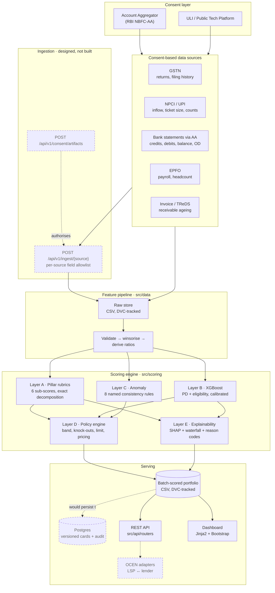
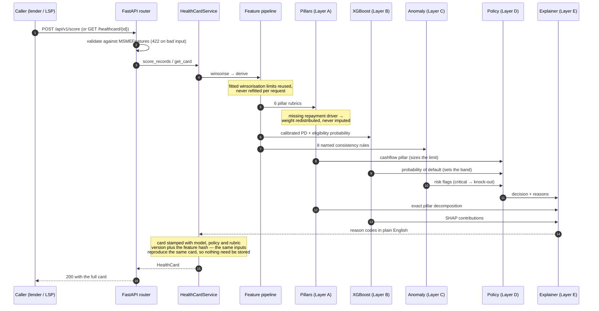
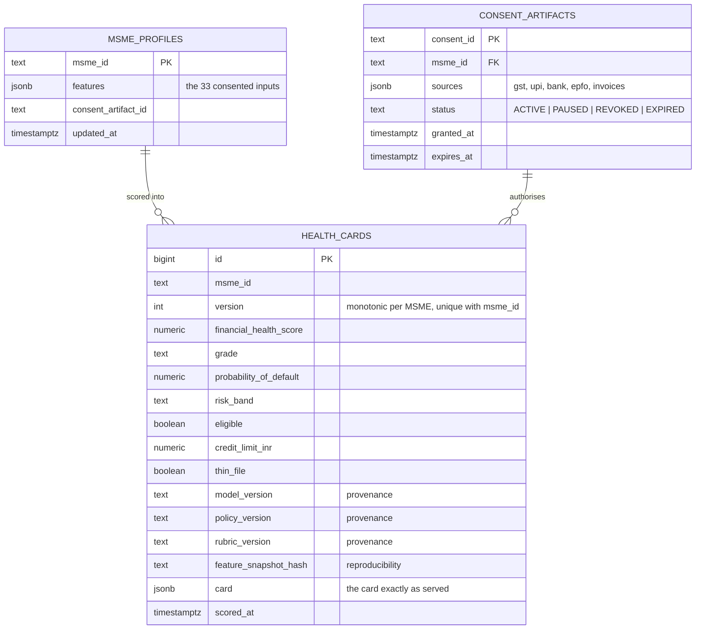
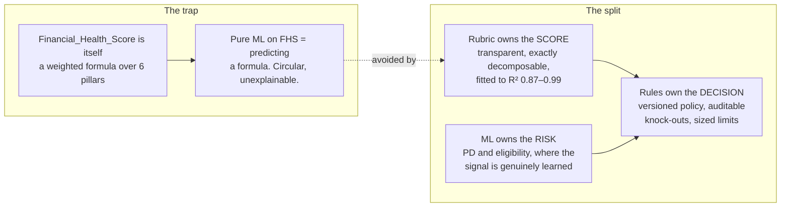

# Architecture

> **Built vs. designed.** This document is the target architecture. Dashed boxes are
> *designed but deliberately not built* here — the consent and
> ingestion layer, the OCEN adapters, and the versioned Postgres card store. The
> dataset is one flat snapshot per firm with no consent layer and no event stream,
> so building those would have meant simulating an interface rather than
> integrating one. [docs/BEYOND_SCOPE.md](BEYOND_SCOPE.md) states what each would
> take. Everything drawn solid runs and is tested.

## 1. Deployment topology

The built path is: raw CSV → feature pipeline → the five scoring layers → the
batch-scored portfolio, read by the REST API and the dashboard. An individual
card is re-scored on demand through the same five layers, so a card is never
served from a stale row.

## 2. Scoring pipeline for one MSME

Each stage is wrapped in `traced_stage`, so the p95 latency claim is measured per
layer rather than asserted. A slow card names the layer that was slow.

## 3. Data model — designed, not built

The service stores no cards: listings come from the batch-scored portfolio and
an individual card is scored on demand, so reproducibility rests on the version
stamps rather than on a stored row. This is the schema a write-through deployment
would use, and it is what the provenance fields on every card already carry.

## 4. Why the scoring engine is hybrid

Two independent witnesses reach the same card: the rubric explains the *score*
by arithmetic, the model explains the *risk* by attribution. When they disagree,
that disagreement is itself information and is surfaced
(`credit.model_eligibility_probability` beside the policy decision).
