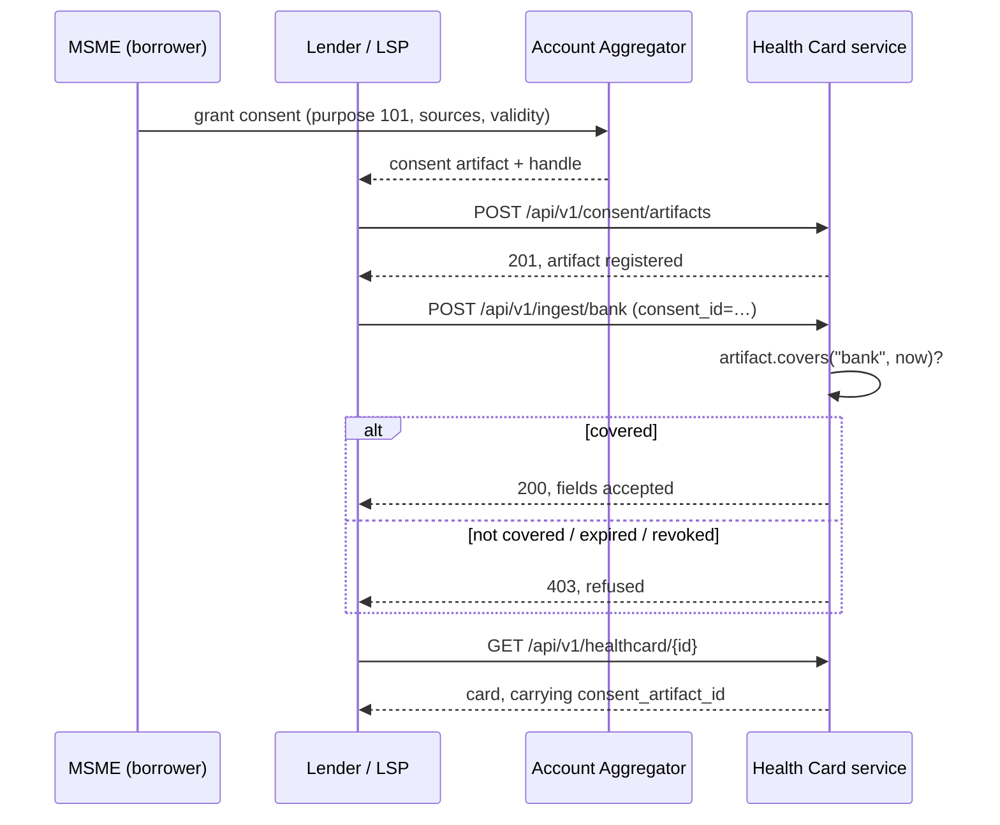

# Integration strategy — ULI, OCEN, Account Aggregator, GSTN

This system is a **scoring and decisioning service**, not a lending platform. It
sits between the consent-based data rails and whatever originates the loan, and it
is deliberately shaped so each rail can be adopted independently.

> **This is a strategy document, not a description of shipped endpoints.** The
> dataset is one pre-joined snapshot per firm with no consent layer and no
> per-source feeds, so the ingestion and consent surfaces below are designed
> rather than built — writing them would have meant mocking the authorisation
> layer of a lending system, which is worse than leaving the seam visible. The
> **Built** column says exactly what runs today; see
> [BEYOND_SCOPE.md](BEYOND_SCOPE.md) for what each omission would take.

## 1. Where it sits

| Rail | Role in this system | Interface | Built |
|---|---|---|---|
| **Account Aggregator** (RBI NBFC-AA) | The lawful basis for holding bank and financial data. Each card would record the consent artifact that authorised it. | `POST /api/v1/consent/artifacts` | No — `consent_artifact_id` is carried on every card but unpopulated |
| **GSTN** | Filing timeliness, declared sales and purchases — the single strongest signal in the model (34% of PD gain). | `POST /api/v1/ingest/gst` | No — consumed as columns of the snapshot |
| **UPI / NPCI** | Transaction cadence, ticket size and volatility: a proxy for real trading activity. | `POST /api/v1/ingest/upi` | No — as above |
| **EPFO** | Payroll regularity and headcount, as an employment-stability signal. | `POST /api/v1/ingest/epfo` | No — as above |
| **ULI / Public Tech Platform** | The aggregation layer a lender would call *us* through. We expose the frictionless data flow it expects. | `POST /api/v1/score`, `GET /api/v1/healthcard/{id}` | **Yes** |
| **OCEN 4.0** | The Loan Service Provider ↔ lender protocol. Thin adapters over the same scoring path. | `POST /ocen/loan-application`, `GET /ocen/offer/{id}` | No — the service layer imports no FastAPI, so an adapter is translation over calls that already exist |

## 2. How consent would be enforced

Under the AA framework and the DPDP Act, holding a firm's bank data is lawful only
while a valid consent artifact covers it. Consent therefore has to be a
first-class object with a real lifecycle — granted, scoped to named sources,
expiring, revocable — and a pull that finds no covering artifact must fail closed.
That is the design; the dataset carries no consent layer to enforce it against,
so what follows is the intended flow rather than a shipped one:



Three properties this design buys:

* **Scope enforcement.** An ingestion call may only write the fields belonging to
  its own source. A GST feed cannot write a bank balance even if it tries — the
  extra fields are refused, not silently dropped.
* **Temporal enforcement.** Coverage is checked on status *and* the validity
  window, so an expired or revoked artifact yields 403 rather than a stale score.
* **Traceability.** `consent_artifact_id` travels on the card — this part exists
  today — so "why do you hold this firm's data?" has an answer with a date on it.

## 3. OCEN adapter design

Designed, not built. The adapter is intentionally thin: an LSP posts an
application, we run the *same* `HealthCardService` path the native API uses, and
shape the answer as an OCEN offer.

```
POST /ocen/loan-application
  → score the borrower
  → sanctioned = min(policy limit, requested amount)
  → tenor      = min(policy tenor, requested tenor)
  → OFFERED with a rate, or DECLINED with reasons
```

The load-bearing constraint is that there is no second policy engine behind OCEN.
Nothing in `src/service` imports FastAPI, so the adapter is a wire format over
decisions the native API already makes — which is why it can be added without
touching the scoring path, and why the two surfaces cannot drift into approving
different things.

Two rules an implementation must carry: never sanction more than was requested
(an offer above the ask is a compliance problem, not a generous one), and never
re-derive the decision — translate the one the policy engine already made.

## 4. Adoption path for a lender

**Phase 1 — batch, no integration.** Point `src/model/batch_inference.py` at an
existing portfolio extract. Produces scored CSV plus the portfolio dashboard.
Nothing to integrate; useful for calibrating appetite against a book you already
know.

**Phase 2 — API, synchronous.** Call `POST /api/v1/score` with a feature payload
assembled by the lender's own data layer. Stateless, no database, p95 under two
seconds. This is the smallest useful integration, and it is where this project
stops.

**Phase 3 — consent-driven.** Register AA consent artifacts, ingest per source as
data arrives, and let cards refresh on consent callbacks. Adds the audit trail and
the versioned card history — the first phase requiring a persistent store; see
[BEYOND_SCOPE.md](BEYOND_SCOPE.md).

**Phase 4 — ULI / OCEN.** Expose the OCEN adapters to LSPs, or register the
scoring endpoint behind ULI. No change to the scoring path.

## 5. What a production deployment still needs

Stated plainly, because a project that claims to be production-ready when it is not
is worth less than one that is honest about the gap. These are the *rail* gaps; the
component-level omissions are in [BEYOND_SCOPE.md](BEYOND_SCOPE.md).

| Gap | Why it is out of scope here | What it would take |
|---|---|---|
| Real AA integration | Requires an NBFC-AA licence and a certified TSP | Contract with an AA (Setu, Finvu, OneMoney); implement the FI request/fetch cycle |
| GSTN API access | Requires GSP credentials | Register as or via a GSP; build the return-fetch behind the ingestion interface |
| Model trained on real defaults | Every risk number here is fitted against a generated label | Retrain on 12–24 months of observed performance; expect the rubric weights to move |
| Bureau reconciliation | Not the target cohort, but required for the ones that do have a record | Add a bureau pull for Existing-to-Credit firms and reconcile against the PD |
| Fair-lending sign-off | Fairness is measured here, not certified | Legal review of the knock-out rules and pricing spreads against RBI digital-lending norms |
| Secrets and key management | `.env` is fine for a demo, not for a lender | AWS Secrets Manager / Vault; rotate the API key; mutual TLS to the AA |

## 6. Non-functional contract

| Property | How it is achieved | Where it is verified |
|---|---|---|
| p95 < 2s for a real-time card | Pure-arithmetic features, small tree models, model loaded once in the lifespan, SHAP warmed at boot | `traced_stage` emits per-layer `ms` on every card |
| No registry call on the request path | `start_api.sh` downloads the production alias before uvicorn starts | `ModelLoader.load()` is local-first |
| Reproducible decisions | `model_version` + `policy_version` + `rubric_version` + `feature_snapshot_hash` on every card, and cards re-scored on demand rather than served from a stored row | Integration test asserts a re-score yields the same snapshot hash |
| Concurrent write safety | Not applicable: nothing is persisted, so there is no version row to race on. A write-through store would need a per-MSME lock plus a `(msme_id, version)` unique constraint | [BEYOND_SCOPE.md](BEYOND_SCOPE.md) |
| Borrower identifiers never logged | `src/utils/pii.py` redaction before logs, audit rows and templates | `tests/unit/utils/test_pii.py` |
